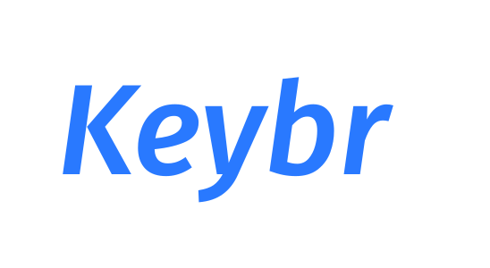

**原作者：** [RealKai42](https://github.com/RealKai42) | [原始项目](https://github.com/RealKai42/qwerty-learner) ⭐  
**分支版本：** [vike-qwerty](https://github.com/baicaofa/vike-qwerty)

## 🌟 主要新功能

### 用户系统

- **支持登录**：本地、云端保存数据，换设备保持数据不变

### 🎨 熟词标记

- **熟词标记**：对于熟词进行标记
- **熟词过滤**：自定义开关，过滤熟词
- **熟词管理**：查看熟词，管理熟词

### 🧠 简化复习系统

- **科学复习**：基于艾宾浩斯遗忘曲线的固定间隔复习
- **简单可靠**：使用固定间隔序列 [1, 3, 7, 15, 30, 60] 天
- **自动毕业**：单词完成所有间隔后自动毕业，避免无限复习
- **容错设计**：误触不影响复习计划，用户体验友好
- **复习练习**：复习 = 重复练习，通过打字强化记忆

<h1 align="center">
  Keybr
</h1>

  为键盘工作者设计的单词记忆与英语肌肉记忆锻炼软件

 

## ✨ 设计思想

软件设计的目标群体为以英语作为主要工作语言的键盘工作者。部分人会出现输入母语时的打字速度快于英语的情况，因为多年的母语输入练就了非常坚固的肌肉记忆 💪，而英语输入的肌肉记忆相对较弱，易出现输入英语时“提笔忘字”的现象。

同时为了巩固英语技能，也需要持续的背诵单词 📕，本软件将英语单词的记忆与英语键盘输入的肌肉记忆的锻炼相结合，可以在背诵单词的同时巩固肌肉记忆。

为了避免造成错误的肌肉记忆，设计上如果用户单词输入错误则需要重新输入单词，尽可能确保用户维持正确的肌肉记忆。

软件也对需要机考英语的人群有一定的帮助。

**For Coder**：

内置了程序员工作常用单词的词库，方便练习工作中常用的单词、提高输入速度。也内置了诸多语言的 API 的练习，帮助以程序员快速熟悉常用的 API，更多语言的 API 正在逐步添加中...

 
 

## 🛠 功能列表

### 词库

内置了常用的 CET-4 、CET-6 、GMAT 、GRE 、IELTS 、SAT 、TOEFL 、考研英语、专业四级英语、专业八级英语，也有程序员常见英语单词以及多种编程语言 API 等词库。 尽可能满足大部分用户对单词记忆的需求，也非常欢迎社区贡献更多的词库。
 
 

### 音标显示、发音功能

方便用户在记忆单词时，同时记忆读音与音标。

 

### 默写模式

在用户完成一个章节的练习后，会弹出选项是否默写本章，方便用户巩固本章学习的单词。

 
 

### 速度、正确率显示

量化用户输入的速度和输入的正确率，让用户有感知的了解自己技能的提升

 

### 简化复习系统

基于艾宾浩斯遗忘曲线理论的轻量级复习系统，帮助用户科学地复习已练习过的单词：

- **固定间隔复习**：采用 1→3→7→15→30→60 天的科学间隔序列
- **自动毕业机制**：单词完成所有间隔后自动毕业，避免无限复习
- **复习即练习**：通过重复打字强化记忆，而非简单的测试
- **智能优先级**：根据逾期时间和复习等级自动排序
- **容错设计**：误触不影响复习计划，同一天可重复练习
- **进度可视化**：清晰显示复习进度和毕业状态

详细说明请参考：[简化复习系统说明文档](./docs/简化复习系统说明.md)

 
 

## 如何贡献

### 贡献词库

[导入词典](./docs/toBuildDict.md)

## 运行项目

本项目是基于`React`开发的，需要 node 环境来运行。

### 手动安装

1. 安装 NodeJS，参考[官方文档](https://nodejs.org/en/download)
2. 使用 `git clone` 下载项目到本地, 不使用 git 可能因为缺少依赖而无法运行
3. 打开命令行，在项目根目录下，运行`yarn install`来下载依赖。
4. 执行`yarn start`来启动项目，项目默认地址为`http://localhost:5173/`
5. 在浏览器中打开`http://localhost:5173/`来访问项目。

## 📕 词库列表

- CET-4
- CET-6
- GMAT
- GRE
- IELTS
- SAT
- TOEFL
- 考研英语
- 专业四级英语
- 专业八级英语
- Coder Dict 程序员常用词
- 高考
- 中考
- 商务英语
- BEC
- 人教版英语 3-9 年级
- 王陆雅思王听力语料库 [@Saigyouji_WKKun](https://github.com/ggehuliang)
- 日语常见词、N1 ～ N5 [@xiaojia](https://github.com/wetery)
- 哈萨克语基础 3000 词(哈拼版) 来源于 [@Elgar](https://github.com/Elgar17) 由 [@Herbert He](https://github.com/HerbertHe) 通过 [哈拼](https://ha-pin.js.org) 技术支持

如果您需要背诵其他词库，欢迎在 Issue 中提出

 
 

## 📗 API 词库

- JavaScript API. [@sdu-gyf](https://github.com/sdu-gyf)
- Node.js API. [@chrysalis1215](https://github.com/chrysalis1215)
- Java API. [@darkSheep](https://github.com/SFAfreshman)
- Linux Command. [@归谜](https://github.com/vhxubo)
- C#: List API [@nidbCN](https://github.com/nidbCN)

 
 

## 🎁 大感谢

### 灵感来源

[Keybr](https://www.keybr.com/)
以算法著称，功能非常完善的打字网站，根据用户输入每个字母的正确率与速度生成“伪英语”来帮助用户集中锻炼个别输入较慢的字母。并可以根据用户的输入记录生成完整的分析报告。

也是本项目的核心灵感来源，Keybr 更多针对英语为母语的用户。在我使用 Keybr 练习打字时，觉得虽然生成的伪英语能够练习输入不顺畅的个别字母，但并不能提升非母语用户对单词的掌握，于是有了本项目。

[Typing Academy](https://www.typing.academy)
非常优秀的打字练习网站
其优秀的 UI 风格，以及对速度、正确率的展示极大的影响了本项目的 UI 设计

[react-code-game](https://github.com/webzhd/react-code-game)
一个非常酷的开源项目，使用 ts 实现，可以在练习打字的同时练习 js 内置 api，项目中添加代码 api 的想法便来源自此项目。
  

### 开源项目

[React](https://github.com/facebook/react) & [CRA](https://github.com/facebook/create-react-app)
完整和详细的文档对初学者非常友好，React 系的文档是我目前自学过程中读过最棒的文档，几乎解决使用中大部分问题。非常感谢 React 对开源世界的贡献，为我们搭建了很好的基础，让初学者也能构建非常棒的软件。

[Tailwindcss](https://tailwindcss.com/docs)
如果没有 tailwind，这个项目还有再拖一阵子，tailwind 的设计思路解决了 css 入门选手对写复杂 css 的恐惧，让新手以一个非常舒适的方式去设计 UI。
  

### 数据来源

字典数据来自于[kajweb](https://github.com/kajweb/dict)，项目爬取了常见的字典，也是这个项目让我看到了实现本项目的希望。

语音数据来源于[有道词典](https://www.youdao.com/)开放 API，感谢有道的贡献让我们这种小项目也可以用上非常专业的发音资源，感谢有道团队以及考神团队为中国教育与中外交流做出的重要贡献。

JS API 来自于[react-code-game](https://github.com/webzhd/react-code-game) ，感谢项目对 JS API 的爬取与预处理。
  

